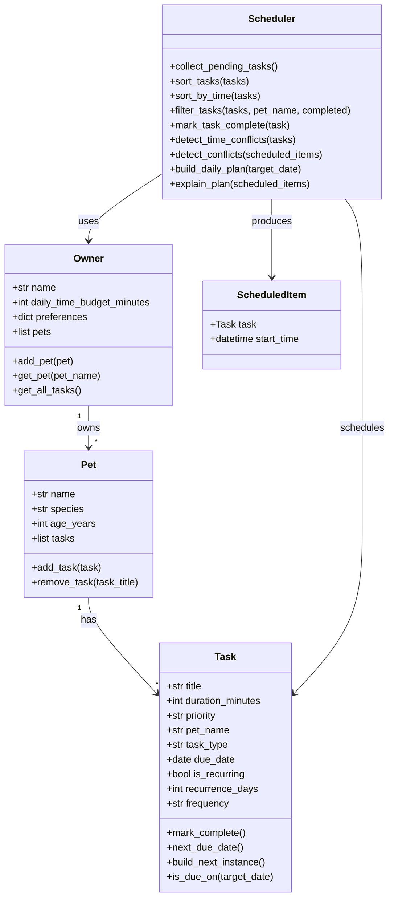

# PawPal+ Project Reflection

## 1. System Design

**a. Initial design**

My initial UML design uses four core classes: `Owner`, `Pet`, `Task`, and `Scheduler`.

Three core user actions I prioritized:
- Add and manage a pet profile (name, species, age).
- Add and manage pet care tasks (feedings, walks, medications, appointments).
- Generate and review today's prioritized schedule.

Class responsibilities:
- `Owner`: stores owner-level constraints (daily time budget, preferences) and owns a list of pets.
- `Pet`: stores pet metadata and task list for that specific pet.
- `Task`: stores task attributes such as duration, priority, due date, recurrence, and completion state.
- `Scheduler`: collects pending tasks, sorts/prioritizes them, detects conflicts, and produces a daily plan with explanations.

Mermaid UML final:

**b. Design changes**

Yes. I refined the design by adding a `ScheduledItem` structure in code to represent a `Task` plus a concrete start time. This keeps planning output separate from raw task definitions and makes conflict detection cleaner.

I also made `priority` a small enum in code instead of plain strings so the scheduler can sort reliably without repeated string checks.

---

## 2. Scheduling Logic and Tradeoffs

**a. Constraints and priorities**

My scheduler considers these constraints: task priority, due date, preferred start time, owner daily time budget, and recurrence cadence (daily/weekly/custom days). It also applies lightweight conflict checks for exact duplicate start times and schedule overlaps.

I prioritized constraints that most directly impact a pet owner's daily execution: first urgency (priority and due date), then practical feasibility (time budget and start times), then quality checks (conflict warnings). This order keeps the plan actionable without over-engineering optimization.

**b. Tradeoffs**

One tradeoff is that conflict detection is intentionally lightweight: it warns when tasks share the same preferred start time and when scheduled items overlap, but it does not run a full optimization search to rearrange every task perfectly.

This is reasonable for the current project scope because it keeps the scheduling logic understandable and fast while still giving the user actionable warnings about problematic timing.

---

## 3. AI Collaboration

**a. How you used AI**

I used Copilot for class design brainstorming, method scaffolding, test generation ideas, and quick code-quality checks while iterating in small steps. It was most helpful when I asked focused, implementation-tied prompts like:
- "How should Scheduler retrieve all tasks from Owner pets without tight coupling?"
- "Suggest readable sorting by HH:MM for task objects with optional times."
- "What edge cases matter for recurrence and conflict detection?"

Prompts that referenced concrete files and methods produced better results than broad prompts.

**b. Judgment and verification**

One suggestion implied time sorting by HH:MM string alone for conflict checks. I rejected that as-is because tasks on different dates can share the same clock time and should not always conflict.

I modified the logic to compare full datetime values for exact-time conflict detection and then verified behavior by running the CLI demo and pytest. This preserved readability while preventing false positives.

---

## 4. Testing and Verification

**a. What you tested**

I tested task completion, task addition to pets, sorting correctness, filtering behavior, recurrence rollover creation, exact-time conflict warnings, empty-plan behavior for pets with no tasks, and weekly recurrence due-date matching.

These tests matter because they cover both user-visible "happy paths" and common edge cases that can silently break planner trust if unverified.

**b. Confidence**

I am highly confident (4/5) for the current scope because the core algorithms are exercised by automated tests and validated in CLI and UI workflows.

With more time, I would test timezone-aware datetimes, recurrence across month/year boundaries, duplicate pet names with different casing, and larger stress cases with many tasks competing for limited budget.

---

## 5. Reflection

**a. What went well**

I am most satisfied with keeping the architecture modular while still shipping practical features end-to-end from backend logic to Streamlit UI and tests.

**b. What you would improve**

In another iteration, I would add a stronger scheduling strategy (for example, weighted scoring or interval packing), improve recurrence editing controls in the UI, and include persistent storage beyond session state.

**c. Key takeaway**

The key takeaway is that AI accelerates implementation, but system quality still depends on human architectural judgment, especially around tradeoffs, edge cases, and verification discipline.
