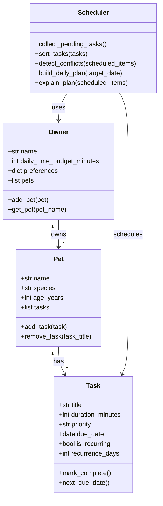

# PawPal+ Project Reflection

## 1. System Design

**a. Initial design**

My initial UML design uses four core classes: `Owner`, `Pet`, `Task`, and `Scheduler`.

Three core user actions I prioritized:
- Add and manage a pet profile (name, species, age).
- Add and manage pet care tasks (feedings, walks, medications, appointments).
- Generate and review today's prioritized schedule.

Class responsibilities:
- `Owner`: stores owner-level constraints (daily time budget, preferences) and owns a list of pets.
- `Pet`: stores pet metadata and task list for that specific pet.
- `Task`: stores task attributes such as duration, priority, due date, recurrence, and completion state.
- `Scheduler`: collects pending tasks, sorts/prioritizes them, detects conflicts, and produces a daily plan with explanations.

Mermaid UML draft:

**b. Design changes**

Yes. I refined the design by adding a `ScheduledItem` structure in code to represent a `Task` plus a concrete start time. This keeps planning output separate from raw task definitions and makes conflict detection cleaner.

I also made `priority` a small enum in code instead of plain strings so the scheduler can sort reliably without repeated string checks.

---

## 2. Scheduling Logic and Tradeoffs

**a. Constraints and priorities**

- What constraints does your scheduler consider (for example: time, priority, preferences)?
- How did you decide which constraints mattered most?

**b. Tradeoffs**

One tradeoff is that conflict detection is intentionally lightweight: it warns when tasks share the same preferred start time and when scheduled items overlap, but it does not run a full optimization search to rearrange every task perfectly.

This is reasonable for the current project scope because it keeps the scheduling logic understandable and fast while still giving the user actionable warnings about problematic timing.

---

## 3. AI Collaboration

**a. How you used AI**

- How did you use AI tools during this project (for example: design brainstorming, debugging, refactoring)?
- What kinds of prompts or questions were most helpful?

**b. Judgment and verification**

- Describe one moment where you did not accept an AI suggestion as-is.
- How did you evaluate or verify what the AI suggested?

---

## 4. Testing and Verification

**a. What you tested**

- What behaviors did you test?
- Why were these tests important?

**b. Confidence**

- How confident are you that your scheduler works correctly?
- What edge cases would you test next if you had more time?

---

## 5. Reflection

**a. What went well**

- What part of this project are you most satisfied with?

**b. What you would improve**

- If you had another iteration, what would you improve or redesign?

**c. Key takeaway**

- What is one important thing you learned about designing systems or working with AI on this project?
